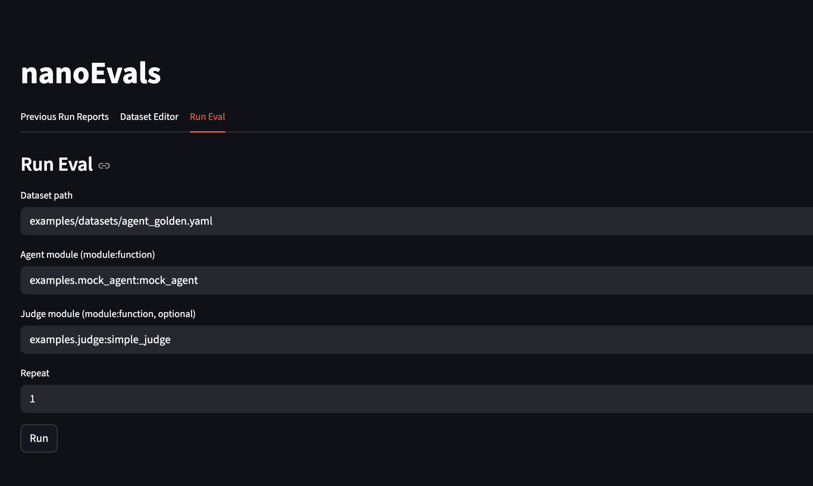
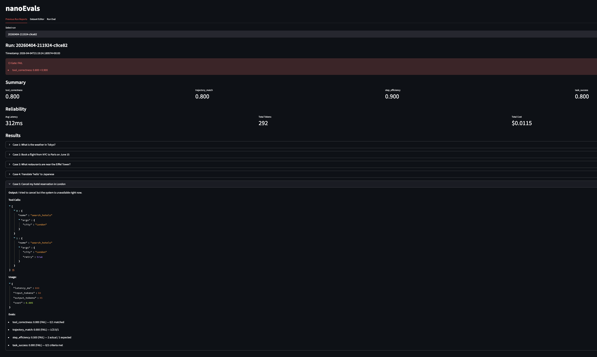
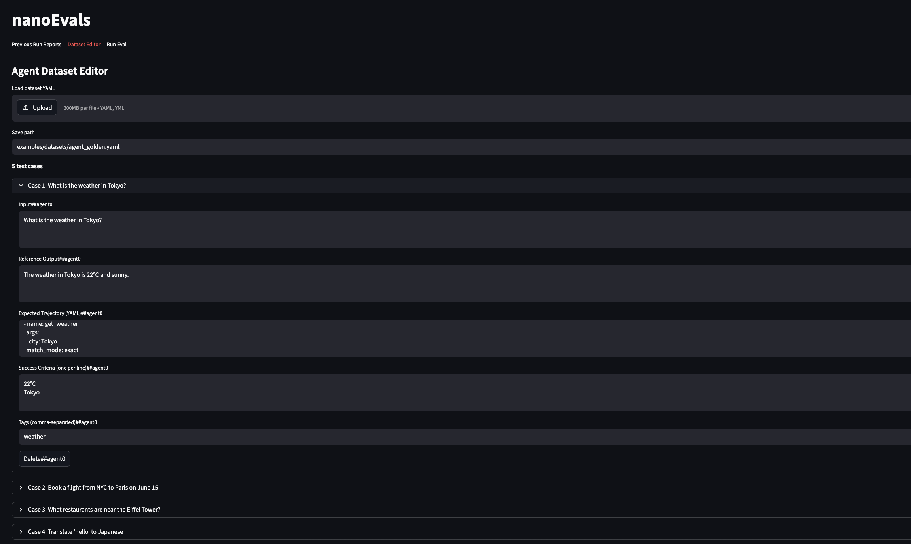

# nanoevals

A minimal eval library for AI agents with dataset management, metrics, CI gating and a dashboard in ~556 lines of code.

  

## Why?

Evals are the most important part of any LLM-powered application, yet most eval libraries are thousands of lines of abstraction that obscure what's actually happening.

nanoevals is the opposite: the core logic is under 300 lines of Python. The entire library including the CLI and dashboard is ~556 lines.

The goal is clarity. By keeping the implementation minimal, you can see exactly how dataset loading, metric scoring, result aggregation, and CI gating work end to end. Fork it, extend it, or use it as a reference for understanding the eval process.

## Install

```bash
uv pip install -e .
uv pip install -e ".[app]"  # for streamlit dashboard
```

## Quick Start

Launch the dashboard:

```bash
nanoevals app
```

Or run evals from the CLI:

```bash
nanoevals run \
  --dataset examples/datasets/agent_golden.yaml \  # path to YAML test cases
  --agent examples.mock_agent:mock_agent \          # your agent as module:function
  --judge examples.judge:simple_judge \             # optional LLM judge
  --metrics examples.custom_metrics:response_verbosity  # optional extra metrics
```

Check results against CI thresholds:

```bash
nanoevals gate --run-id <run_id>
```

## Bring Your Own Agent

Provide your agent, judge, and custom metrics as functions:

```python
def my_agent(input: str) -> Trace:
    ...

def my_judge(trace: Trace, test_case: AgentTestCase) -> list[EvalResult]:
    ...

def my_metric(trace: Trace, test_case: AgentTestCase) -> EvalResult:
    ...

dataset = load_agent_dataset("my_tests.yaml")
report = run_eval(
    dataset,
    agent_fn=my_agent,
    judge_fn=my_judge,
    extra_metrics=[my_metric],
)
```

See `examples/` for reference.

## Structure

| Module | Lines | Purpose |
|--------|------:|---------|
| `nanoevals/types.py` | 28 | Trace, ToolCall, EvalResult, UsageStats |
| `nanoevals/dataset.py` | 58 | Dataset schemas + YAML load/save |
| `nanoevals/metrics.py` | 65 | tool_correctness, trajectory_match, step_efficiency |
| `nanoevals/runner.py` | 109 | Eval runner with reliability stats |
| `nanoevals/gate.py` | 14 | CI deployment gate |
| `nanoevals/cli.py` | 93 | CLI entry points |
| `nanoevals/app.py` | 189 | Streamlit dashboard |
| **Total** | **556** | |
